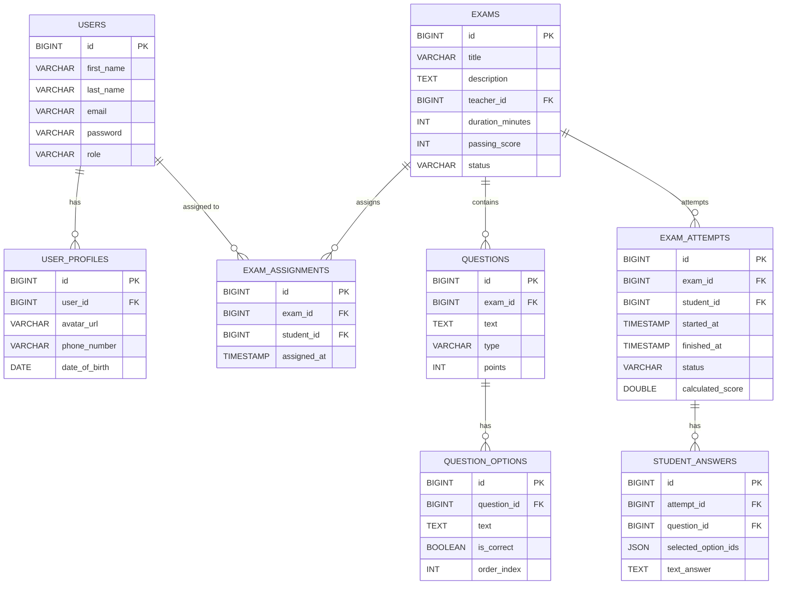

## ER Diagram (high level)

Ниже — упрощённая ER-диаграмма основных таблиц домена экзаменов (Mermaid):

```mermaid
erDiagram
    USERS {
        BIGINT id PK
        VARCHAR first_name
        VARCHAR last_name
        VARCHAR email
        VARCHAR password
        VARCHAR role
    }

    USER_PROFILES {
        BIGINT id PK
        BIGINT user_id FK
        VARCHAR avatar_url
        VARCHAR phone_number
        DATE date_of_birth
    }

    EXAMS {
        BIGINT id PK
        VARCHAR title
        TEXT description
        BIGINT teacher_id FK
        INT duration_minutes
        INT passing_score
        VARCHAR status
    }

    QUESTIONS {
        BIGINT id PK
        BIGINT exam_id FK
        TEXT text
        VARCHAR type
        INT points
    }

    QUESTION_OPTIONS {
        BIGINT id PK
        BIGINT question_id FK
        TEXT text
        BOOLEAN is_correct
        INT order_index
    }

    EXAM_ASSIGNMENTS {
        BIGINT id PK
        BIGINT exam_id FK
        BIGINT student_id FK
        TIMESTAMP assigned_at
    }

    EXAM_ATTEMPTS {
        BIGINT id PK
        BIGINT exam_id FK
        BIGINT student_id FK
        TIMESTAMP started_at
        TIMESTAMP finished_at
        VARCHAR status
        DOUBLE calculated_score
    }

    STUDENT_ANSWERS {
        BIGINT id PK
        BIGINT attempt_id FK
        BIGINT question_id FK
        JSON selected_option_ids
        TEXT text_answer
    }

    USERS ||--o{ USER_PROFILES : has
    USERS ||--o{ EXAM_ASSIGNMENTS : "assigned to"
    EXAMS ||--o{ EXAM_ASSIGNMENTS : "assigns"
    EXAMS ||--o{ QUESTIONS : contains
    QUESTIONS ||--o{ QUESTION_OPTIONS : has
    EXAMS ||--o{ EXAM_ATTEMPTS : attempts
    EXAM_ATTEMPTS ||--o{ STUDENT_ANSWERS : has
```